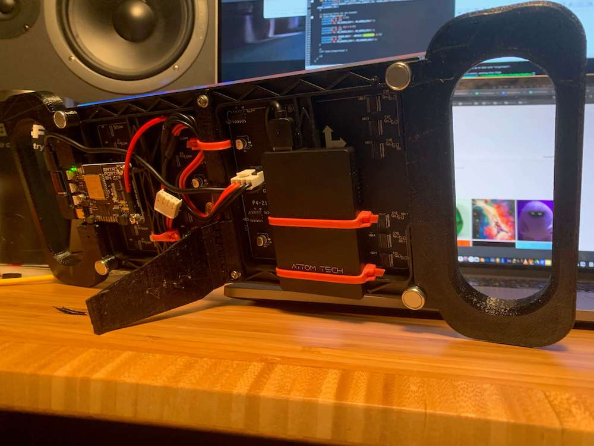
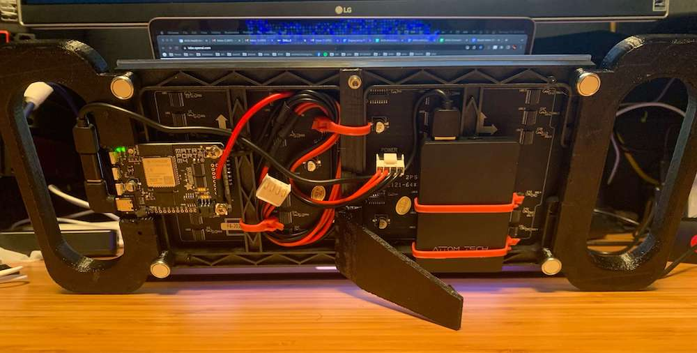

# MatrixPortal M4 Handle STLs (from [Adafruit](https://learn.adafruit.com/matrix-portal-sand/assembly))
- [Right-Matrix-Handle.stl](Right-Matrix-Handle.stl)
- [Left-Matrix-Handle.stl](Left-Matrix-Handle.stl)

# Got Magnet feet?
- [MatrixPortal-MagnetFeetWashers.stl](MatrixPortal-MagnetFeetWashers.stl)
  - print some washers to tighten the loose handle fit
  - drill out the 2 holes in each handle with 7/32" drill bit for the magnet feet

# Kickstands are .... AWESOME
- [MatrixPortalKickstand.stl](MatrixPortalKickstand.stl)

# Battery?
We ended up using the [Attom Tech 3000mAh](https://www.amazon.com/gp/product/B07JZCZSH9/ref=ppx_yo_dt_b_asin_title_o02_s00?ie=UTF8&psc=1) 0.35" thin battery (you have only 0.5" clearence on the back so 0.35" was perfect), and zip-tying the battery to the frame.  Works great.  Thin enough so we can still use the magnetic feet to stick the display to a metal fridge or filecabinet.

### Some people might benefit from these battery mounts as well (from [Adafruit](https://learn.adafruit.com/matrix-portal-sand/assembly))
- [battery-holder-horz.stl](battery-holder-horz.stl)
- [battery-holder-vert.stl](battery-holder-vert.stl)

